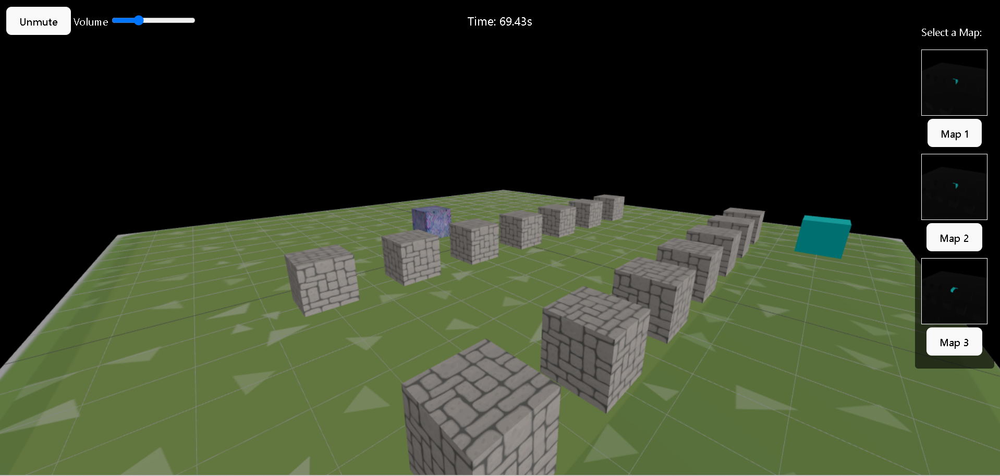
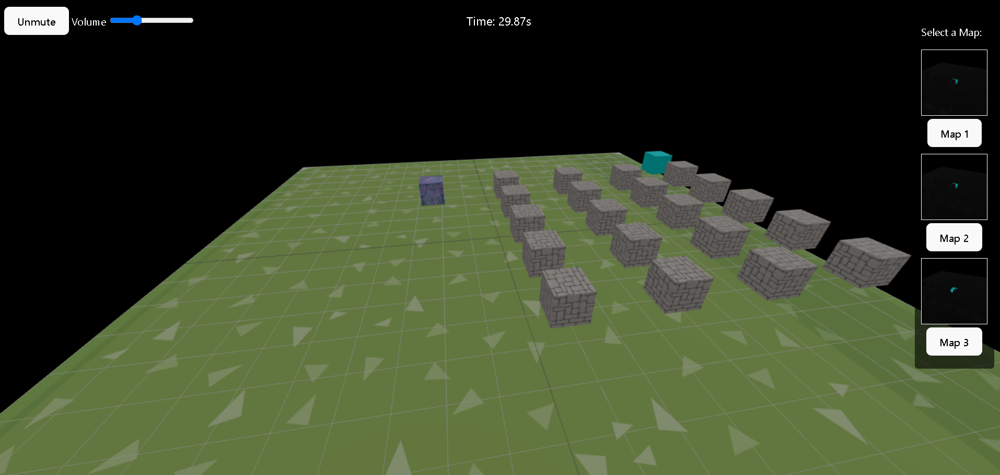
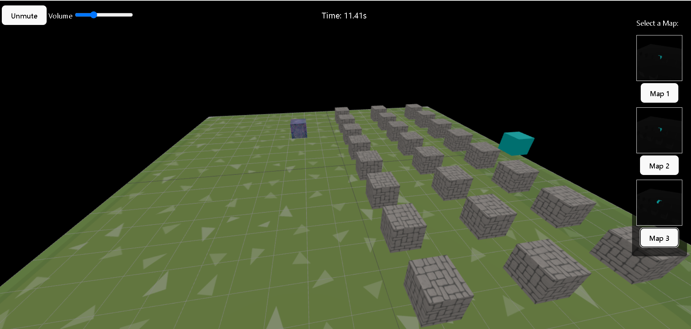

# 🎮 3D Obstacle Game

Welcome to the **3D Obstacle Game** – a fun, interactive 3D game built using **Three.js** and **Vite**. Control your player cube, avoid obstacles, and reach the goal while racing against the timer!

---

##  Visual Overview

### Main Game


### Map Previews



---

## 🎮 Controls

| Key / Action      | Description                |
|-------------------|----------------------------|
| W / Up Arrow      | Move Forward               |
| S / Down Arrow    | Move Backward              |
| A / Left Arrow    | Move Left                  |
| D / Right Arrow   | Move Right                 |
| Spacebar          | Jump                       |
| Click             | Move to clicked point      |

---

## 🎥 Project Demo

Watch the game in action here:


##  Project Structure

```text
project-root/
├── public/
│   ├── sounds/
│   │   ├── background.mp3
│   │   ├── jump.mp3
│   │   └── victory.mp3
│   ├── textures/
│   │   ├── player.jpg
│   │   ├── obstacle.jpg
│   │   └── floor.jpg
│   └── images/
│       ├── main-game.png
│       ├── map-preview1.png
│       └── map-preview2.png
├── src/
│   ├── main.js
│   └── style.css
├── index.html
├── package.json
└── README.md

```

---

##  Technologies Used
- **Three.js** – For 3D rendering and object management.
- **Vite** – For fast development and bundling.
- **JavaScript** – Core game logic and interactivity.
- **HTML & CSS** – UI structure and basic styling.

---

##  Features
- Real-time 3D graphics and player movement.
- Smooth camera controls using OrbitControls.
- Sound effects: background music, jump sound, and victory sound.
- Multiple map selections with mini map previews.
- Obstacle collision detection.
- Jump animation and gravity physics.
- Mouse click movement.
- Timer to track your completion time.
- Game restart functionality.
- Volume control and mute/unmute options.

---

##  Installation

### 1. Clone the Repository
```bash
git clone https://github.com/yourusername/3d-obstacle-game.git
```
### 2. Navigate to Project Folder
```bash
cd 3d-obstacle-game
```
### 3. Install Dependancies
```bash
npm install
```
##  Running the Game Locally
```bash
npm run dev
```
##  Folder Details
- /public/sounds/: Game audio files.
- /public/textures/: Player, obstacle, and floor textures.
- /src/main.js: Main game logic.
- /src/style.css: Game styling.

