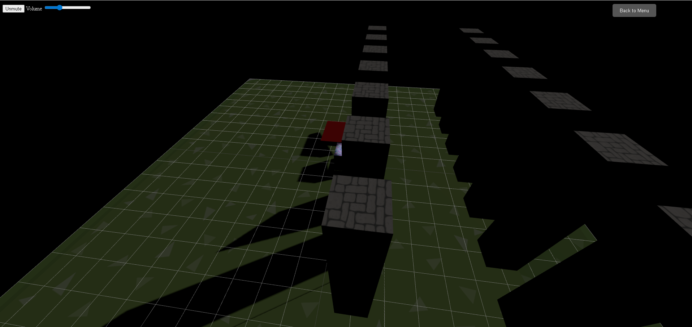
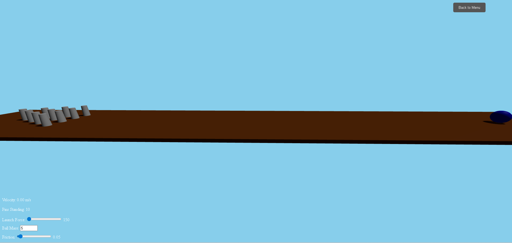

# 🎮 3D Game Hub

Welcome to the **3D Game Hub** – an interactive 3D platform featuring multiple games built using **Three.js** and **CANNON.js**. Select a game from the main menu, control your player, and have fun!


---

###  Visual Overview

**Main Game Menu**


**3D Obstacle Game**


**Bowling Game**


---

## 🎮 Controls

The controls are game-specific.

#### Obstacle Game
| Key / Action | Description |
| :--- | :--- |
| **W** / Up Arrow | Move Forward |
| **S** / Down Arrow | Move Backward |
| **A** / Left Arrow | Move Left |
| **D** / Right Arrow | Move Right |
| **Spacebar** | Jump |
| **E** | Enter / Exit Plane |
| **W** / Up Arrow | Plane: Move Forward |
| **S** / Down Arrow | Plane: Move Backward |
| **A** / Left Arrow | Plane: Move Left |
| **D** / Right Arrow | Plane: Move Right |
| **Y** | Plane: Fly Up |
| **U** | Plane: Fly Down |

#### Bowling Game
| Key / Action | Description |
| :--- | :--- |
| **Spacebar** | Launch the bowling ball |
| **UI Sliders** | Adjust ball mass, launch force, and friction |


---

### 🎥 Project Demo

[](https://www.youtube.com/watch?v=nfW4luAdQUM)

Check out the full video on YouTube.


##  Project Structure

```text
project-root/
├── public/
│   ├── sounds/
│   │   ├── background.mp3
│   │   ├── jump.mp3
│   │   └── victory.mp3
│   ├── textures/
│   │   ├── player.jpg
│   │   ├── obstacle.jpg
│   │   └── floor.jpg
│   └── images/
│       ├── main-game-menu.png
│       ├── main-game.png
│       ├── bowling-game.png
│       ├── map-preview1.png
│       └── map-preview2.png
├── src/
│   ├── games/
│   │   ├── blockGame.js
│   │   ├── bowlingGame.js
│   │   └── PlaneController.js
│   ├── main.js
│   └── style.css
├── index.html
├── package.json
└── README.md


```

---

###  Technologies Used

[](https://threejs.org/)
[](https://schteppe.github.io/cannon.js/)
[](https://vitejs.dev/)
[](https://developer.mozilla.org/en-US/docs/Web/JavaScript)


* **Three.js** – For 3D rendering and object management.
* **CANNON.js** – For physics simulation in the bowling game.
* **Vite** – For fast development and bundling.
* **JavaScript** – Core game logic and interactivity.
* **HTML & CSS** – UI structure and basic styling.


---

###  Features
* **Multi-Game Selection:** A central menu to choose between different games.
* **Real-time 3D Graphics:** Fluid graphics and responsive player movement.
* **Physics Simulation:** Realistic ball and pin physics powered by CANNON.js.
* **Player Transformation:** Players can switch between a ground-based cube and a flying plane.
* **Smooth Camera Controls:** Implemented using OrbitControls.
* **Sound Effects:** Background music, jump sound, and victory sounds.
* **Dynamic Maps:** The obstacle game offers multiple maps with previews.
* **Player & Game Controls:** Customizable game physics (mass, force, friction) and real-time data display (velocity, pins standing).
* **Obstacle Collision Detection:** Prevents players from passing through walls.
* **Game State Management:** Timers, score tracking, and restart functionality.
* **Modular Architecture:** Each game is a self-contained module, making the project scalable.

---

---

##  Installation

### 1. Clone the Repository
```bash
git clone https://github.com/shyamharsh/3DGame.git
```
### 2. Navigate to Project Folder
```bash
cd 3DGame
```
### 3. Install Dependancies
```bash
npm install
```
##  Running the Game Locally
```bash
npm run dev
```
##  Folder Details
- /public/sounds/: Game audio files.
- /public/textures/: Player, obstacle, and floor textures.
- /src/games: Contains the core logic for each individual game.
- /src/main.js: The central game launcher and UI manager.
- /src/style.css: All game styling.
 ---

 ### 🎥 Project Demo

[](https://3-d-games-chi.vercel.app/)
  

